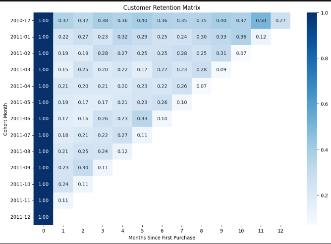
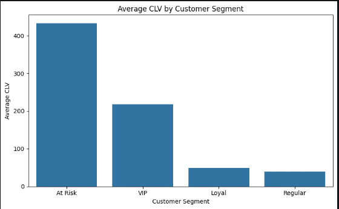
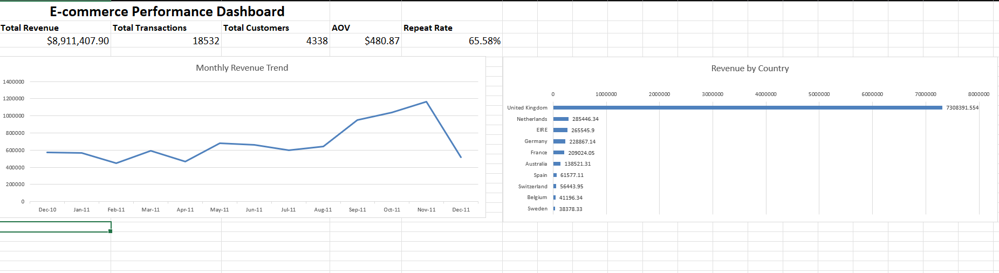

## Customer Analytics & Retention Intelligence (SQL | Python | Excel)
Overview

This project analyzes transactional customer data to identify retention patterns, quantify churn, and measure customer lifetime value (CLV).

The goal is to understand customer behavior and uncover revenue risks using SQL and Python.

**Business Problem**

Businesses often lack visibility into:

- Which customers drive the most revenue
- Which customers are at risk of churn
- Where long-term revenue is being lost

Without this insight, retention strategies are reactive and inefficient.

**Objective**

- Segment customers based on behavior (RFM)
- Measure churn and retention patterns
- Analyze customer lifetime value (CLV)
- Identify revenue risk and retention opportunities

**Approach**

**Data Preparation & EDA**
- Cleaned and validated transactional data
- Explored distributions and key variables

**Descriptive Analysis (SQL + Python)**
- Monthly revenue and transaction trends
- Average order value (AOV)
- Repeat purchase behavior (~65%)
- Country-level performance

**Customer Segmentation (RFM)**

Customers were segmented using:

- Recency (time since last purchase)
- Frequency (purchase count)
- Monetary value (total spend)

Segments:

- VIP
- Loyal
- At Risk
- Regular

**Retention Analysis**
- Churn defined as no purchase within 30 days
- Churn rate: ~61.57%
- Average customer lifespan: ~130 days

Cohort analysis was used to track customer retention over time.

**Customer Lifetime Value (CLV)**

CLV was calculated using:

CLV = Average Order Value × Purchase Frequency × Customer Lifespan

CLV was analyzed across customer segments to understand long-term revenue contribution.

**Key Insight**

Customers in the At Risk segment represent the highest average lifetime value, indicating that a significant portion of revenue is tied to customers who are no longer actively purchasing.

This highlights a clear opportunity for targeted retention strategies.

**Visualizations**

**Retention Heatmap**

This heatmap shows customer retention by cohort over time.
There is a sharp drop-off after the first purchase, indicating weak early retention.

**CLV by Customer Segment**

This chart compares average customer lifetime value across segments and highlights revenue concentration in high-risk customers.

**Excel Dashboard**

This dashboard summarizes key business metrics including revenue, transactions, customer count, average order value, and repeat purchase rate.

It provides a high-level view of performance trends and supports quick decision-making.

**Tech Stack**
- SQL (SQLite)
- Python (pandas, numpy, matplotlib, seaborn)
- Jupyter Notebooks
- Excel (basic dashboard)

**Conclusion**

This project demonstrates how transactional data can be used to:

- Identify churn risk
- Measure retention
- Quantify customer value
- Inform data-driven business decisions

